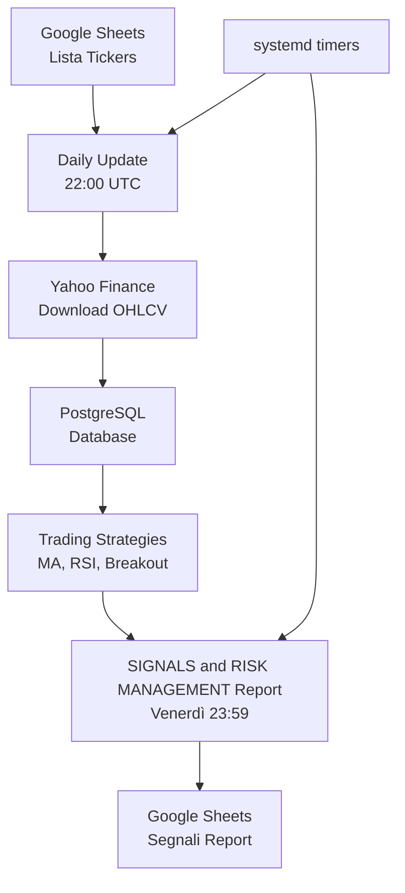

# Money Trading System 📈

Un sistema automatizzato per la generazione di segnali di trading basato su analisi tecnica, con aggiornamento automatico dei dati e report settimanali.

## 📊 Status


**Ultimo aggiornamento**: 26 Agosto 2025  
**Versione**: 1.0.0  
**Ticker monitorati**: 33  
**Strategie attive**: 3

## 🎯 Panoramica

**Money** è una pipeline finanziaria completa che:
- **Monitora automaticamente** una lista di ticker/ETF da Google Sheets
- **Scarica prezzi storici** giornalieri tramite Yahoo Finance
- **Applica strategie di trading** basate su indicatori tecnici
- **Genera report settimanali** con segnali BUY/SELL/HOLD
- **Gestisce tutto automaticamente** tramite systemd timers


### Architettura del Sistema



---

## 🚀 Quick Start

### Prerequisiti
- **Python 3.10+**
- **PostgreSQL** (locale o remoto)
- **Google Cloud Project** con Secret Manager abilitato
- **VM Linux** con accesso systemd

### Installazione Rapida

```bash
# 1. Clone del repository
git clone <repository-url>
cd money

# 2. Setup ambiente virtuale
python3 -m venv env
source env/bin/activate
pip install -r requirements.txt

# 3. Configurazione secrets (vedi sezione Configurazione)
# 4. Inizializza database
python init_db.py

# 5. Test manuale
python run_daily_update_db.py
python run_weekly_report.py
```

---

## 📊 Funzionalità Principali

### 1. **Aggiornamento Automatico Dati**
- **Frequenza**: Ogni giorno alle 22:00 UTC (00:00 ora italiana)
- **Fonte**: Yahoo Finance tramite `yfinance`
- **Gestione**: Inserimento/aggiornamento automatico con gestione duplicati
- **Formato**: OHLCV (Open, High, Low, Close, Volume)

### 2. **Strategie di Trading Implementate**

| Strategia | Descrizione | Parametri |
|-----------|-------------|-----------|
| **Moving Average Crossover** | Incrocio medie mobili corte/lunghe | `short_window=3`, `long_window=5` |
| **RSI Strategy** | Relative Strength Index con soglie | `period=14`, `overbought=70`, `oversold=30` |
| **Breakout Strategy** | Rotture di massimi/minimi storici | `lookback=20` |

### 3. **Report Settimanali Automatici**
- **Frequenza**: Ogni venerdì alle 23:59
- **Formato**: Google Sheets con fogli separati per strategia
- **Contenuto**: Segnali BUY/SELL/HOLD + statistiche riassuntive

---

## 🛠️ Configurazione

### Google Cloud Setup

Il sistema utilizza **Google Cloud Secret Manager** per le credenziali:

```bash
# Secrets richiesti:
# - db_info: credenziali PostgreSQL
# - service_account: credenziali Google Sheets/Drive
```

**Esempio `db_info` secret:**
```json
{
  "DB_HOST": "localhost",
  "DB_PORT": "5432", 
  "DB_NAME": "trading",
  "DB_USER": "postgres",
  "DB_PASSWORD": "password"
}
```

### Systemd Services

Il sistema usa due timer systemd per l'automazione:

```bash
# Abilita i servizi
sudo systemctl enable --now update_db.timer
sudo systemctl enable --now weekly_signals.timer

# Verifica stato
systemctl list-timers | grep -E "(update_db|weekly)"
```

---

## 📁 Struttura del Progetto

```
money/
├── 🚀 Entry Points
│   ├── run_daily_update_db.py     # Aggiornamento quotidiano
│   ├── run_weekly_report.py       # Report settimanale
│   └── test.py                    # Testing e debug
├── 🧠 Core Business Logic
│   └── scripts/
│       ├── config.py              # Configurazione centralizzata
│       ├── database.py            # Gestione PostgreSQL
│       ├── google_services.py     # Google Cloud integrations
│       ├── data_fetcher.py        # Download da Yahoo Finance
│       ├── strategies.py          # Strategie di trading
│       ├── signals.py             # Generazione segnali
│       └── reports.py             # Creazione report
├── 📊 Data & Logs
│   ├── logs/                      # Log applicazioni
│   └── docs/                      # Documentazione
└── 🔧 Config Files
    ├── requirements.txt
    └── .gitignore
```

---

## 💡 Esempi d'Uso

### Aggiungere Nuovi Ticker
1. Modifica il **Google Sheet** con ID: `1Uh3S3YCyvupZ5yZh2uDi0XYGaZIkEkupxsYed6xRxgA`
2. Il sistema rileverà automaticamente i nuovi ticker al prossimo aggiornamento

### Creare una Nuova Strategia

```python
# scripts/strategies.py
def my_custom_strategy(df, param1=10, param2=0.02):
    """
    La mia strategia personalizzata.
    
    Args:
        df: DataFrame con colonne ['Close', 'Volume', etc.]
        param1: Parametro personalizzato
        param2: Altro parametro
    
    Returns:
        DataFrame con colonna 'signal' (-1=SELL, 0=HOLD, 1=BUY)
    """
    df = df.copy()
    # ... logica della strategia ...
    df['signal'] = 0  # Inizializza
    # ... calcoli e condizioni ...
    return df
```

### Test Manuale delle Strategie

```python
# test.py
from scripts.strategies import moving_average_crossover
from scripts.database import get_universe_data
from scripts.signals import generate_signals_df

# Carica dati storici
df = get_universe_data(end_date="2025-08-26", tickers=["AAPL", "MSFT"])

# Genera segnali
signals = generate_signals_df(moving_average_crossover, df, short_window=3, long_window=5)
print(signals)
```

---

## 📈 Monitoraggio e Log

### File di Log
```bash
# Log principali
tail -f logs/run_daily_update_db.log     # Aggiornamenti quotidiani
tail -f logs/run_weekly_report.log       # Report settimanali

# Log systemd
journalctl -u update_db.service -f       # Real-time logs
journalctl -u weekly_signals.service -f
```

### Verifica Stato Sistema
```bash
# Verifica timers
systemctl list-timers | grep -E "(update_db|weekly)"

# Verifica ultima esecuzione
systemctl status update_db.service
systemctl status weekly_signals.service

# Verifica database
python check_db.py
```

---

## 🔧 Risoluzione Problemi

### Problemi Comuni

**🚨 Errore connessione database**
```bash
# Verifica connettività
psql -h $DB_HOST -U $DB_USER -d $DB_NAME

# Riavvia servizio PostgreSQL
sudo systemctl restart postgresql
```

**🚨 Errore download Yahoo Finance**
```bash
# Verifica connettività internet
curl -I https://finance.yahoo.com

# Esecuzione manuale per debug
python run_daily_update_db.py
```

**🚨 Timer non si avvia**
```bash
# Ricarica configurazione systemd
sudo systemctl daemon-reload

# Riavvia timers
sudo systemctl restart update_db.timer weekly_signals.timer
```

---

## 🚧 Roadmap

### In Sviluppo
- [ ] **Backtesting Engine**: Test storico delle strategie
- [ ] **Risk Management**: Gestione del rischio e position sizing
- [ ] **Performance Analytics**: Metriche di performance delle strategie
- [ ] **Alert System**: Notifiche push/email per segnali critici

### Pianificato
- [ ] **Portfolio Optimizer**: Ottimizzazione allocazione capitali
- [ ] **Machine Learning**: Strategie basate su ML/AI
- [ ] **Multi-timeframe**: Analisi su diversi orizzonti temporali
- [ ] **Alternative Data**: Integrazione sentiment, news, etc.

---

## 🤝 Contribuire

1. **Fork** del repository
2. **Branch** per la feature: `git checkout -b feature/nome-feature`
3. **Commit** delle modifiche: `git commit -m 'Add: nuova feature'`
4. **Push** al branch: `git push origin feature/nome-feature`
5. **Pull Request**

### Sviluppo Locale
```bash
# Setup ambiente sviluppo
export MONEY_ENV=development  # Abilita modalità debug
python test.py                # Test componenti individuali
```

---

## 📄 Licenza

Questo progetto è rilasciato sotto licenza **MIT**.

---

## 📞 Supporto

- **Issues**: Usa GitHub Issues per bug report e feature request
- **Discussions**: GitHub Discussions per domande generali

---

